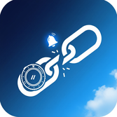
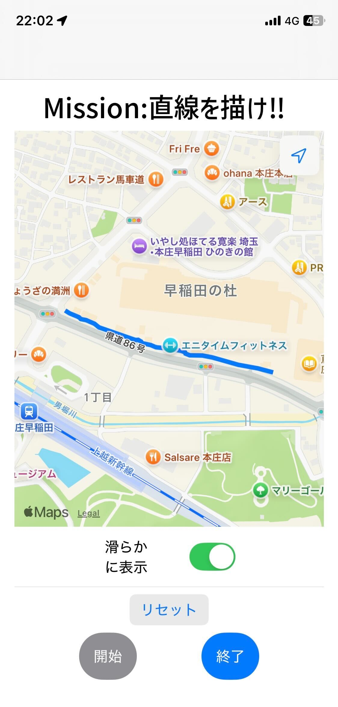

# GarminDisconnectNotifyApp

⛓️🔔 **Garmin デバイスの Bluetooth 接続が切れたら iPhone に通知する iOS アプリ**

---

## 📱 アプリアイコン

---
## ✨ UI イメージ

このアプリは、地図上に移動ルートを描画する機能を含んでいます（通知機能とは別に、アプリのデモ/機能の一部であると仮定して画像を配置しています）。

### 起動・スタート画面

### ミッション・マップ画面

---

## 📖 概要

Garmin ウォッチ（例: *Forerunner 255S Music*）と iPhone の Bluetooth 接続を監視し、  
接続が切断されたときに **iPhone にローカル通知（バナー・音）** を表示するアプリです。

- 接続中 / 切断時のログを Xcode コンソールに出力
- 切断検知時に「Garmin 切断」の通知を送信
- バックグラウンドでも監視可能（Background Modes 対応）

---

## 🛠 環境

- macOS (Xcode 15 以上)
- iOS 16 以降（実機必須）
- Garmin デバイス（Forerunner シリーズなど）

---

## ⚙️ セットアップ

1. このリポジトリをクローン
